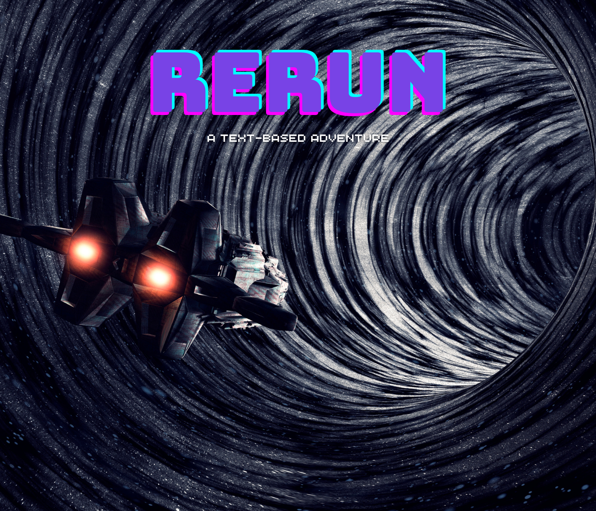
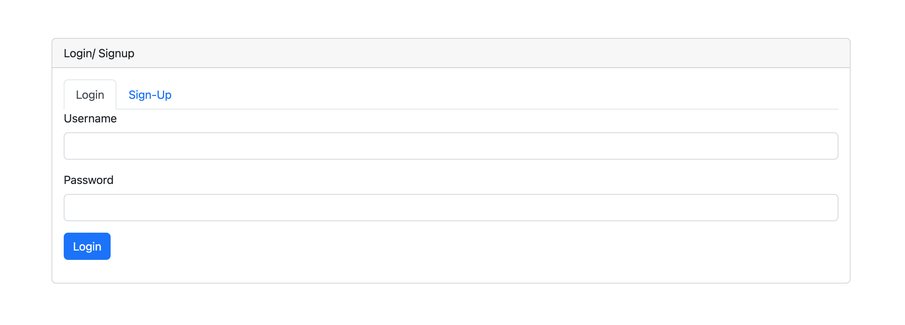
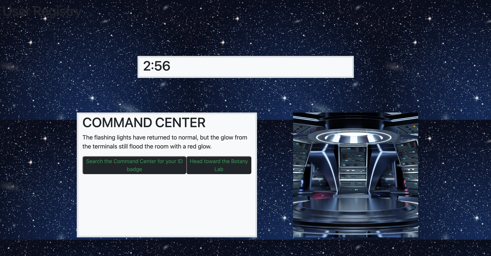
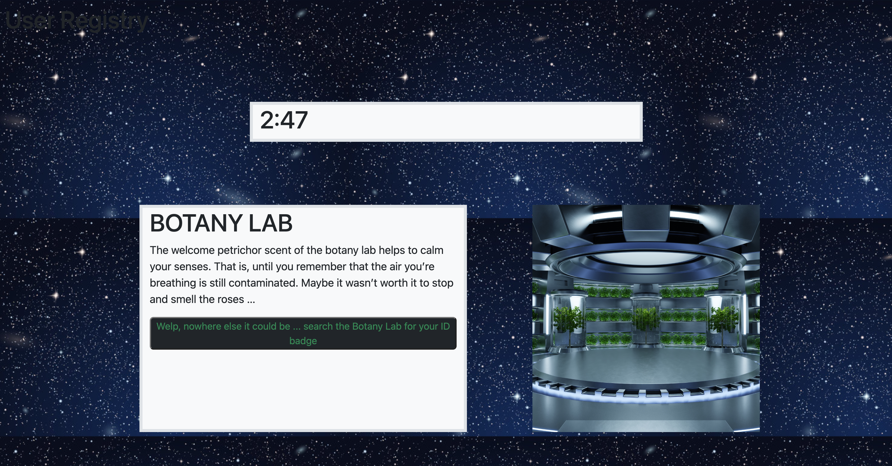
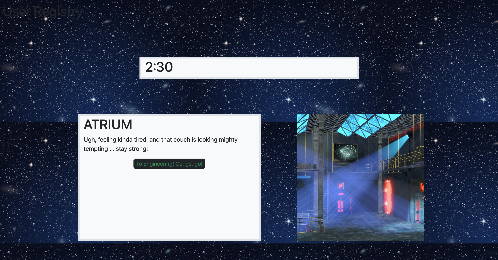

# Rerun  

A Text-based, speed-run adventure game where you must beat the clock - or Rerun!  

## Objective  
Build a fun, fast, text-based game to entertain nostalgic nerds.  

## User Story
AS A text-based game lover  
I WANT a super rad game with an engaging story and leaderboard to track best run-times  
SO THAT I can be entertained  

## How to Use
1. Open webapp at (link to deployed app on Heroku)
2. Login or sign up using email, a unique username, and a password of at least 8 characters.  
3. Read the game prompts and use the buttons to select your choice of action or movement through the game.
4. Be careful! Some wrong moves will cost you precious time!
5. If you run out of time, the game will automatically restart.
6. If you beat the clock; CONGRATS! Add your username and runtime to the leaderboard.  

## Functionality
The following images show the apps functionality during login and gameplay:  
  
  

  

## Future Updates
We hope to roll out several updates with the game including additional levels/stories, in-game inventory, and email capability to contact our users when updates are expected or released.

## Challenges

The biggest challenges we faced were organzing the database and making sure that multiple functionalities could work together simultaneously (ie timer, sounds, story cards, etc).

## Technologies  
        

## Contact the Creators on GitHub 

Ayush Umrani  
https://github.com/AyushUmrani  

Corbin Cansler  
https://github.com/canslercp  

Mike Augustine  
https://github.com/Okapikid  

Ashley Thompson  
https://github.com/Ashley1Thompson

